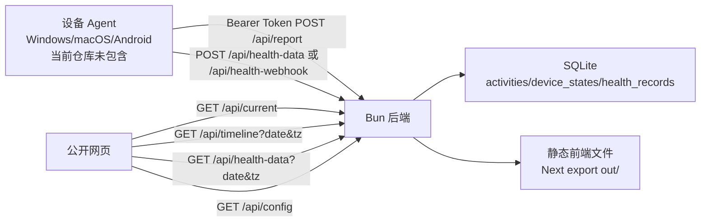

# Live Dashboard 项目分析报告

分析时间：2026-05-31  
分析范围：`D:\Code\live-dashboard` 当前目录内的源码、文档和部署配置。

## 1. 项目定位

Live Dashboard 是一个个人实时活动展示仪表盘。设备端 Agent 上报当前应用、窗口标题、音乐、电池和健康数据，服务端写入 SQLite，前端以公开网页形式展示当前状态、历史活动和健康摘要。

从当前仓库看，实际包含：

- 后端：Bun + TypeScript + SQLite，位于 `packages/backend`。
- 前端：Next.js 15 + React 19 + Tailwind CSS 4 静态导出，位于 `packages/frontend`。
- 部署：`Dockerfile`、`docker-compose.yml`、`docker-compose.example.yml`、Nginx 示例。
- 文档：`README.md`、`PROJECT_PLAN.md`、两张预览图。

当前仓库不包含：

- README 中提到的 Windows Agent、macOS Agent、Android App 源码。
- 根目录级 package workspace 配置。
- 自动化测试、CI 配置、数据库迁移工具。

## 2. 目录结构

```text
live-dashboard/
  packages/
    backend/
      src/
        index.ts                  # Bun HTTP 服务入口
        db.ts                     # SQLite 初始化、迁移片段、预编译语句
        middleware/auth.ts         # DEVICE_TOKEN_N Bearer 认证
        routes/                    # report/current/timeline/health/config 等 API
        services/                  # 应用映射、隐私分级、NSFW、访客、站点配置
        data/                      # app-names.json、nsfw-blocklist.json
    frontend/
      app/                         # Next App Router 页面和全局样式
      src/hooks/                   # useDashboard、useConfig
      src/lib/                     # API client、应用描述
      src/components/              # 仪表盘 UI 组件
  deploy/nginx/example.conf
  Dockerfile
  docker-compose.yml
  docker-compose.example.yml
  start.sh
  README.md
  PROJECT_PLAN.md
  watchme/
```

粗略规模：`packages` 下约 41 个源码/配置文件，共约 4837 行。最大的几个文件是：

- `packages/frontend/src/lib/app-descriptions.ts`：约 737 行。
- `packages/frontend/app/globals.css`：约 501 行。
- `packages/backend/src/services/privacy-tiers.ts`：约 453 行。
- `packages/backend/src/data/app-names.json`：约 364 行。
- `packages/frontend/src/components/HealthData.tsx`：约 352 行。

这说明项目的复杂度主要堆在“展示文案/映射表/隐私策略/样式”上，而不是业务流程本身。

## 3. 系统架构



典型数据流：

1. Agent 用 `Authorization: Bearer <token>` 上报 `app_id`、`window_title`、`timestamp`、`extra`。
2. 后端根据 token 反查设备信息。
3. 后端通过 `app-mapper.ts` 解析应用名。
4. 后端用 `nsfw-filter.ts` 拦截敏感内容。
5. 后端用 `privacy-tiers.ts` 从原始窗口标题生成可公开的 `display_title`。
6. 原始 `window_title` 不写入数据库，只写入空字符串，同时用 `HASH_SECRET` 生成 HMAC 作为去重键的一部分。
7. 前端每 10 秒轮询 `/api/current` 和 `/api/timeline`，按设备、日期和标签页渲染。

## 4. 后端分析

### 4.1 服务入口

`packages/backend/src/index.ts` 使用 `Bun.serve` 手写路由分发。API 与静态文件托管在同一个进程里：

- API 路由包括 `/api/report`、`/api/current`、`/api/timeline`、`/api/health-data`、`/api/health-webhook`、`/api/config`、`/api/health`。
- 静态资源通过 `STATIC_DIR` 指向 Next 静态导出目录。
- HTML 文件会经过 `injectSiteConfig` 注入站点名称、标题、描述和 favicon。
- 静态文件读取有 `realpath` 和相对路径校验，做了路径穿越和符号链接逃逸防护。
- CORS 目前是 `Access-Control-Allow-Origin: *`。

优点：入口小、部署简单、静态文件和 API 一体化，容器里只需要一个服务。  
缺点：路由、错误处理、鉴权、限流、日志和响应格式没有统一抽象，后续扩展会越来越难。

### 4.2 数据库

`packages/backend/src/db.ts` 使用 `bun:sqlite`，启动时自动建表并做少量列迁移。

主要表：

- `activities`：历史活动记录，按 `device_id + app_id + title_hash + time_bucket` 去重。
- `device_states`：设备当前状态，保存最后在线时间、当前应用、公开标题和 `extra` JSON。
- `health_records`：健康记录，按 `device_id + type + recorded_at + end_time` 去重。

值得肯定的点：

- 开启 WAL、`busy_timeout`、`synchronous=NORMAL`，适合轻量单机写入。
- 有基本索引：活动按时间、设备和创建时间查询；健康数据按时间和类型查询。
- `HASH_SECRET` 未设置时直接拒绝启动，避免无密钥哈希导致隐私设计失效。

主要风险：

- 迁移逻辑散落在 `db.ts`，没有版本号和回滚能力。
- `date(started_at)` 和 `date(started_at, modifier)` 查询会削弱索引利用，数据变多后时间线查询可能变慢。
- `window_title` 列仍存在但永远写空，说明 schema 和隐私策略之间已经有历史包袱。
- 健康数据模型把所有指标压成 `type/value/unit`，灵活但弱约束。例如血压在 webhook 中只存 systolic，diastolic 丢失。

### 4.3 认证

`packages/backend/src/middleware/auth.ts` 从环境变量读取 `DEVICE_TOKEN_N`，格式为：

```text
token:device_id:device_name:platform
```

优点：

- 简单直接，适合个人项目。
- 允许设备名里包含冒号。
- 平台限定为 `windows | android | macos`。

缺点：

- token 明文只来自环境变量，没有轮换、吊销、过期或权限分级。
- 无请求签名，无 replay 防护。
- token 数量一多，环境变量管理会变差。

### 4.4 上报 API

`POST /api/report` 的核心逻辑在 `packages/backend/src/routes/report.ts`：

- 要求 Bearer Token。
- `app_id` 必填。
- `window_title` 最长 256 字符。
- 客户端时间戳只接受服务器当前时间正负 5 分钟内。
- NSFW 命中后静默返回 `{ ok: true }`。
- `extra` 只白名单电池和音乐字段。
- 原始窗口标题不存储，只存 `display_title` 和 HMAC。

优点：隐私意识很强，输入字段也做了裁剪和白名单。  
缺点：缺少 body size 限制、速率限制、结构化 schema 校验和统一错误码。去重桶使用服务端当前时间而不是规范化后的 `startedAt`，延迟上报时可能影响去重语义。

### 4.5 当前状态和时间线

`GET /api/current`：

- 返回所有设备状态、最近 20 条活动、服务端时间和访客数。
- 会剥离 `window_title`，并把 `extra` JSON 字符串解析为对象。
- 会根据 IP 和 User-Agent 更新内存访客数。

`GET /api/timeline`：

- 必须传 `date=YYYY-MM-DD`。
- 可传 `tz`，用 SQLite date modifier 做本地日期换算。
- 可传 `device_id`。
- 根据相邻同设备活动计算 duration，间隔超过 2 分钟时把上一个片段截到 1 分钟。
- 输出 segments 和按设备聚合的 summary。

风险：

- duration 是从离散心跳推断出来的，不是真实应用使用时长。
- 当某应用是当天最后一个活动时，duration 可能是 0，除非下一次活动出现。
- 前端随后又按 app 聚合，会丢失原始时间顺序，项目名叫 Timeline，但实际 UI 更像“当天应用汇总列表”。

### 4.6 健康数据

有两个写入入口：

- `POST /api/health-data`：内部统一格式，单次最多 500 条。
- `POST /api/health-webhook`：适配外部 Health Connect webhook 格式，单次最多 2000 条。

查询入口：

- `GET /api/health-data?date=YYYY-MM-DD&tz=-480&device_id=...`

优点：支持批量插入、去重和时区查询，类型覆盖较广。  
风险：健康数据属于敏感数据，但查询端点是公开的，和公开展示的产品定位一致，却需要在文档里明确告知使用者。

## 5. 前端分析

### 5.1 技术形态

前端是 Next.js App Router，但配置了 `output: "export"`，实际作为静态站点发布。运行时 API 地址来自 `NEXT_PUBLIC_API_BASE`，为空时默认同源。

页面核心在 `packages/frontend/app/page.tsx`：

- `useDashboard()` 管理当前状态、时间线、日期、错误、加载状态和访客数。
- `useConfigLoader()` 拉取站点配置。
- 自动选择第一个在线设备。
- 设备全离线时给 `body` 加 `night-mode`。
- 健康数据只在所选设备和日期有记录时显示健康标签页。

### 5.2 数据获取

`packages/frontend/src/hooks/useDashboard.ts` 每 10 秒轮询：

- `/api/current`
- `/api/timeline?date=...&tz=...`

优点：

- 使用 `AbortController` 取消过期请求。
- 用 `requestId` 防止旧请求覆盖新状态。
- 首屏和日期切换逻辑清晰。

缺点：

- 轮询频率固定，无法根据页面可见性、失败次数或在线状态调节。
- 没有缓存层，日期来回切换会重复请求。
- 没有统一 API 错误模型，UI 只能显示粗粒度失败状态。

### 5.3 UI 和样式

主要组件：

- `Header.tsx`：标题、问候语、服务端时间、访客数。
- `CurrentStatus.tsx`：当前设备状态、应用描述、音乐和电池。
- `DeviceCard.tsx`：设备列表和在线状态。
- `DatePicker.tsx`：日期切换。
- `Timeline.tsx`：按设备聚合应用活动。
- `HealthData.tsx`：健康指标卡片和心率 SVG 趋势图。
- `SiteMetadataSync.tsx`：客户端同步 title、meta、favicon。

优点：

- 视觉风格完整，日夜模式和动效都已有实现。
- 有 `prefers-reduced-motion` 处理，照顾动效敏感用户。
- 健康图表没有引入重型图表库，体量可控。

缺点：

- `globals.css` 约 500 行，样式和主题逻辑高度集中。
- `app-descriptions.ts` 约 737 行，文案、分类、模板和兜底逻辑混在一个文件。
- UI 文案中英文混杂，例如 Devices、prev、next、today 与中文主体并存。
- `DatePicker.tsx` 里 `formatDisplay` 未使用，说明已有小规模代码沉积。
- 前后端类型重复定义，未来改接口容易漂移。

## 6. 隐私与安全分析

做得好的地方：

- 原始窗口标题不公开，也不实际写入数据库。
- 用 HMAC 而不是普通 hash 做标题去重，降低彩虹表风险。
- 浏览器标题有敏感关键词过滤。
- NSFW 命中静默丢弃。
- favicon 和站点配置注入做了 HTML/JS 转义。
- 静态文件服务有路径穿越和 symlink 防护。

需要重构时重新设计的地方：

- 未知应用默认 `show`，如果映射缺失，可能把某些新聊天、银行或医疗类应用标题公开成 `display_title`。
- `GET /api/health-data` 是公开接口，健康数据对个人而言敏感。
- CORS 全开放，若 token 泄漏，浏览器环境也可以跨站上报。
- API 层没有内建限流，只在 Nginx 示例中对 `/api/report` 给了配置。
- 没有审计日志、异常 request id、token 使用记录或设备最后错误状态。

## 7. 部署和开发体验

### 7.1 Docker

`Dockerfile` 是两阶段构建：

1. 用 `oven/bun:1-alpine` 构建前端静态导出。
2. 复制后端和前端 `out` 到运行镜像，非 root 用户运行，SQLite 数据放 `/data`。

这是当前项目较成熟的部分。

### 7.2 Compose

`docker-compose.example.yml` 适合快速试用，直接映射 `3000:3000`。

`docker-compose.yml` 更像作者个人 VPS 配置：

- 使用外部网络 `your_external_network`。
- 固定 IP `172.20.0.80`。
- 不暴露 ports，依赖 Nginx 或外部网络访问。

这会让普通开发者直接 `docker compose up` 时失败或无法访问，需要在文档里区分“示例部署”和“作者私有部署”。

### 7.3 start.sh

`start.sh` 声称是 macOS 本地一键启动，但当前目录没有 `agents/macos`。脚本会创建和运行：

- `agents/macos/config.json`
- `agents/macos/.venv`
- `agents/macos/requirements.txt`
- `agents/macos/agent.py`

这些路径当前不存在。README 说 Agent 源码在其他分支，当前仓库里的 `start.sh` 因此不能作为可靠本地启动脚本。

### 7.4 本机验证记录

当前环境：

- `node --version`：v22.14.0。
- `bun --version`：不可用，PowerShell 提示未安装。
- `packages/frontend/node_modules`：不存在。
- `packages/backend/node_modules`：不存在。

因此本次没有运行 Bun 后端、Next 构建或 Docker 构建。已完成的是源码阅读、结构检查、关键配置检查和 JSON 解析行为检查。

## 8. 数据质量观察

`packages/backend/src/data/app-names.json` 可被 Node `JSON.parse` 解析，当前统计为：

- Windows：153 个键。
- Android：92 个键。
- macOS：111 个键。

但 PowerShell `ConvertFrom-Json` 会因为 `QQMusic.exe` 和 `qqmusic.exe` 这种大小写差异键报重复。运行时代码会把 key 全部转小写放进 Map，所以后者会覆盖前者。当前这两个值相同，影响不大，但这类数据最好在重构时加校验，避免隐藏冲突。

## 9. 主要优点

1. 隐私优先意识明确：原始标题不存储，HMAC 去重，公开标题分级处理。
2. 架构足够轻：Bun + SQLite + 静态前端，很适合个人部署。
3. 功能闭环已经存在：设备上报、当前状态、历史活动、健康数据、站点配置和静态托管都有实现。
4. 前端体验完整：加载、错误、离线夜间模式、多设备、健康标签页都有基本状态。
5. 部署镜像设计不错：多阶段构建、非 root 用户、数据卷、日志限制都有考虑。
6. 代码分层有雏形：routes、services、hooks、components 没有完全混在一起。
7. 静态文件安全处理认真：路径规范化、realpath 校验和 HTML 配置注入转义都值得保留。

## 10. 主要缺点和风险

1. 当前仓库边界不完整：README 描述的是多分支/多 Agent 生态，但当前目录只有 Dashboard 核心。
2. 缺少测试体系：没有单测、集成测试、端到端测试或 CI 配置。
3. 没有共享 API 契约：后端 `types.ts` 和前端 `api.ts` 分别定义类型，容易漂移。
4. 大文件承担过多职责：应用描述、隐私分级、全局 CSS 都已经变成重构重点。
5. 数据库迁移不可持续：启动时直接 `ALTER TABLE`，没有迁移版本和变更记录。
6. 健康数据公开展示的边界需要更明确：这可能是产品意图，但必须让部署者显式知道。
7. Docker Compose 有个人环境痕迹：默认 `docker-compose.yml` 不是通用本地启动配置。
8. `start.sh` 与当前仓库不匹配：引用缺失的 Agent 路径。
9. 时间线更像聚合列表：UI 没有展示真实一天的时间轴，产品语义和组件名有偏差。
10. 未知应用默认展示标题：从隐私角度看，默认 hide 或 per-device allowlist 更稳。
11. 前端静态导出限制了服务端能力：动态元数据、鉴权页面、实时推送等都需要额外设计。
12. 本地开发依赖 Bun，但根目录没有统一 workspace 和启动命令，新人进入成本偏高。

## 11. 适合保留的设计

- SQLite 单机持久化和 WAL 模式。
- 原始窗口标题不入库的原则。
- `display_title` 与原始标题分离的思路。
- 设备 token 的轻量接入方式，可以先保留再增强。
- 前端静态导出加后端同源托管的部署方式。
- `extra` 白名单思想。
- `prefers-reduced-motion` 处理。
- 站点配置注入能力。

## 12. 重构优先级建议

P0 必做：

- 把当前分析、新项目和未来代码都放在 `watchme/` 内，避免和原项目混杂。
- 建立新项目的 workspace、统一脚本和依赖锁。
- 用 schema 库统一请求、响应、数据库输入输出。
- 补基础测试：隐私处理、应用映射、report API、timeline 计算。
- 明确健康数据公开策略。

P1 推荐：

- 抽出隐私策略和应用映射为数据文件，并添加冲突校验。
- 引入正式数据库迁移。
- 统一 API 错误响应和日志。
- 把轮询替换为可降级的 SSE 或 WebSocket，或至少加页面可见性退避。
- 拆分 CSS，建立轻量设计 token 和组件样式边界。

P2 可后置：

- 多用户支持。
- 数据导出。
- 管理页面。
- Agent 配置分发。
- 更复杂的数据可视化。

