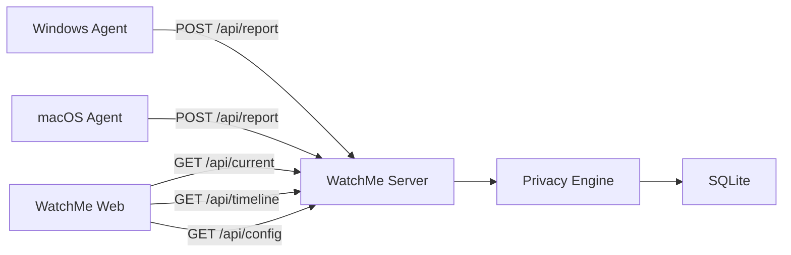

# WatchMe 项目架构

## 1. 架构概览

WatchMe 的目标架构是一个轻量全栈系统：



核心职责：

- Agent：采集本机当前活动，不判断公开展示策略。
- Server：认证设备、处理隐私、存储数据、提供公开 API。
- Web：展示公开数据，不接触原始窗口标题。
- Shared：定义跨模块共享的数据契约。

## 2. 目标目录

```text
refactor/
  apps/
    server/
    web/
  agents/
    windows/
    macos/
  packages/
    shared/
    privacy/
    app-catalog/
    db/
    ui/
```

## 3. 模块边界

### `packages/shared`

职责：

- API request/response schema。
- 设备平台枚举。
- extra payload 类型。
- 通用日期工具。
- 统一错误结构。

不放：

- 数据库查询。
- React 组件。
- 平台采集代码。

### `packages/privacy`

职责：

- 应用隐私等级判断。
- 窗口标题安全处理。
- 浏览器标题敏感词过滤。
- HMAC 标题哈希。
- 敏感/NSFW 过滤。

输入：

- `app_id`
- `app_name`
- `window_title`
- 用户 allowlist 配置

输出：

- `display_title`
- `visibility`
- `title_hash`
- `drop_reason`

### `packages/app-catalog`

职责：

- app id 到 app name 的映射。
- app 分类。
- 展示描述模板。
- 应用图标或 emoji 映射。

要求：

- 数据文件可校验。
- 大小写冲突要被测试发现。
- 未知应用有稳定 fallback。

### `packages/db`

职责：

- SQLite schema。
- migrations。
- prepared queries。
- 数据库 row 类型。

原则：

- DB row 和 API DTO 分开。
- migrations 有版本。
- 查询尽量使用可索引条件。

### `apps/server`

职责：

- HTTP API。
- 静态文件服务。
- 设备认证。
- 后台任务：离线检测、数据清理。
- 调用 privacy 和 db。

不做：

- 直接写复杂隐私规则。
- 在 route handler 里拼业务大逻辑。

### `apps/web`

职责：

- 仪表盘 UI。
- 当前状态、设备列表、活动视图。
- 加载/错误/空状态。
- 调用公开 API。

不做：

- 不接触 token。
- 不展示或保存原始窗口标题。
- 不内置隐私判断，只消费服务端输出。

### `agents/windows` 和 `agents/macos`

职责：

- 读取配置。
- 采集当前前台应用和窗口标题。
- 采集 AFK、音频、全屏、电池、音乐状态。
- 上报 `/api/report`。
- 失败退避。

不做：

- 不决定标题是否公开。
- 不写数据库。
- 不持有服务端管理逻辑。

## 4. 数据流

### 上报流

1. Agent 采集 `app_id`、`window_title`、`timestamp`、`extra`。
2. Agent 使用 Bearer Token 调用 `POST /api/report`。
3. Server 根据 token 绑定设备身份。
4. Server 校验 request schema。
5. Server 解析 app name。
6. Privacy Engine 生成 `display_title` 和 `title_hash`。
7. Server 写入 `device_states` 和 `activities`。
8. Server 返回 `{ ok: true }`。

### 展示流

1. Web 轮询或订阅 `/api/current`。
2. Server 读取设备状态。
3. Server 返回公开 DTO。
4. Web 渲染当前状态和设备列表。
5. Web 查询 `/api/timeline` 渲染当天活动。

## 5. 公开数据原则

公开 API 可以包含：

- `device_id`
- `device_name`
- `platform`
- `app_name`
- `display_title`
- `last_seen_at`
- `is_online`
- 经白名单处理的 `extra`

公开 API 不允许包含：

- 原始 `window_title`
- token
- 本地文件路径
- 未处理的浏览器标题
- 私密健康数据，除非用户显式启用

## 6. MVP API

```text
GET  /api/health
GET  /api/config
GET  /api/current
GET  /api/timeline?date=YYYY-MM-DD&tz=-480&device_id=...
POST /api/report
```

## 7. MVP 数据表

```text
devices
device_states
activities
schema_migrations
```

可后续添加：

```text
daily_summaries
health_records
viewer_sessions
```

## 8. 关键风险

- 隐私规则过松导致公开敏感标题。
- Agent 平台 API 在不同系统版本不稳定。
- 前后端类型漂移。
- 时间线 duration 只是推断，不是真实精确使用时长。
- references 中的旧实现包含构建产物和历史包袱，不能直接作为主源码。

